# RTAB-Map TurtleBot3 RGB-D 在线建图与 Nav2 点到点避障

## 完整技术路线、阶段演进、结果证据与复现示范报告

**报告日期：** 2026-08-24  
**工作区：** /home/w417/RTAB-Map  
**当前分支：** main  
**主机：** Ubuntu 20.04 + NVIDIA RTX 4090  
**容器：** Ubuntu 22.04 + ROS 2 Humble  
**机器人：** TurtleBot3 Waffle  
**传感器：** 仿真 RGB-D；导航链路不使用 /scan

> 这是一份面向示范、复现和交接的长篇技术报告。它把源码、参数、启动链路、实验记录、
> 失败排查和正式结果放在同一条叙事中。正文中的图片来自仓库已有实验结果，不是重新
> 生成的示意图；正式结果、历史参考和代码级复现必须按各自证据等级理解。

---

## 0. 先看结论：当前系统完成了什么

### 0.1 已经完成的能力

当前系统已经在两个静态 Gazebo 障碍物世界中完成：

1. 模拟 RGB-D 图像和深度流；
2. RTAB-Map online=true、localization=false 的边走边建图；
3. RGB-D 深度到点云、障碍点云和地面点云；
4. Nav2 根据当前地图、当前机器人位姿和当前目标生成全局路径；
5. GoalLineSmacPlanner 在 SmacPlanner2D 上增加当前起点到目标直线的软偏好；
6. RPP 局部路径跟踪、速度调节和前视碰撞预测；
7. velocity_smoother 速度平滑；
8. collision_monitor RGB-D 减速与硬停止；
9. 多目标逐段导航、双视角轨迹图、时间、路径、末端误差和 Gazebo contacts 记录。

### 0.2 正式证据总览

| 阶段/场景 | 任务 | profile | 正式结果 |
| --- | --- | --- | --- |
| 原生基准 | A→B，inflation 0.45 m，3 次 | Smac + RPP | 3/3，平均 wall 114.913 s，平均 Gazebo 路径 18.173 m，0/3 非地面 contacts |
| 目标线优化 | A→B，3 次 | GoalLineSmacPlanner | 3/3，平均 wall 约 113.63 s，平均 Gazebo 路径约 17.977 m，0/3 contacts |
| 快速 v4 | A→B，3 次 | fast_goalline_045_v4 | 3/3，平均 wall 约 81.07 s，平均 Gazebo 路径 17.382 m，0/3 contacts |
| 自适应双目标 | M→A→B，3 次 | adaptive_goal_line_045 | 6/6 段成功，平均 wall 约 137.64 s，0/3 contacts |
| 大场景五点闭环 | M→A→B→C→D→M，3 次 | adaptive_goal_line_045 | 3/3 run，15/15 段，平均 wall 288.563 s，0/3 contacts |
| 场景 01 顺序验证 | 三组五点闭环各 3 次 | adaptive_goal_line_045 | 9/9 run，45/45 段，0/9 contacts |
| 场景 02 MN 基线 | M→N，3 次 | adaptive_goal_line_045 | 3/3，0/3 contacts |
| 场景 02 四点闭环 v5 | M→N→X→Y→M，3 次 | adaptive_goal_line_050_recovery_v5 | 3/3 run，12/12 段，0/3 contacts；旧版有南侧长回环参考案例 |
| 场景 02 四点闭环 v13 | M→N→X→Y→M，3 次 | adaptive_goal_line_050_recovery_v13_line_tiebreaker | 3/3 run，12/12 段，平均 wall 509.826 s，平均 Gazebo 路径 93.825 m，0/3 contacts |

### 0.3 能力边界

当前证据支持：

> 在两个设计好的、静态的 Gazebo 室内障碍物场景中，系统能够在没有 LiDAR、使用 RGB-D
> 在线建图的条件下，完成逐段点到点导航、实时重规划、障碍物绕行和仿真物理接触验收。

当前证据不支持：

- 任意陌生环境都能 100% 成功；
- 动态行人、动态障碍物、透明/反光/黑色物体下仍有相同表现；
- 任意窄通道、完全封闭死角或感知失真时都能自动恢复；
- v13 已在真实 D435i 和真实底盘上验证；
- Gazebo 无碰撞等同于真实机器人安全；
- 三次回归构成统计学意义上的泛化证明。

---

## 1. 项目目标、任务和坐标约定

### 1.1 项目目标

本项目要验证的不是一次性的速度命令，而是一条完整的 RGB-D-only 室内导航链路：

~~~text
RGB-D
  -> 在线 SLAM 与位姿估计
  -> 占据地图与障碍点云
  -> 全局代价地图
  -> 当前起点到目标的实时路径搜索
  -> 局部路径跟踪与速度调节
  -> 碰撞监视与安全速度输出
  -> 移动底盘
~~~

“点到点”表示每段给出一个目标 pose，系统在当时可获得的地图和障碍观测上重新求解。
它不表示机器人一定沿欧氏直线运动，也不表示启动前已经知道整个世界。

### 1.2 点位

| 点 | 坐标 (x, y) m | 用途 |
| --- | ---: | --- |
| M | (-8.5, 0.0) | 左侧起点/闭环返回点 |
| A | (5.0, -3.0) | 右下目标 |
| B | (5.0, 6.0) | 右上目标 |
| C | (-5.0, 4.0) | 左上目标 |
| D | (0.0, 0.0) | 中央目标 |

场景 01 的三组访问顺序：

~~~text
M -> A -> B -> C -> D -> M
C -> A -> D -> B -> M -> C
B -> M -> A -> C -> D -> B
~~~

场景 02 的四点任务：

~~~text
M(-8.5, 0.0) -> N(8.5, 0.0) -> X(-3.0, -4.0)
    -> Y(5.0, 5.0) -> M(-8.5, 0.0)
~~~

每个箭头都是一个独立 NavigateToPose 目标段。前一段结束后，脚本才发送下一段，
不会把历史轨迹作为下一段路径回放。

### 1.3 坐标系

| 坐标系 | 作用 |
| --- | --- |
| map | RTAB-Map 在线建图坐标系；全局 costmap 和目标默认使用它 |
| odom | Gazebo/TurtleBot3 连续局部里程计；局部 costmap 使用它 |
| base_link / base_footprint | 机器人底盘坐标系 |
| camera_link / 光学帧 | RGB-D 传感器坐标系 |

轨迹记录器从 /odom 读取位姿，再通过 TF 转到 map。TF 不可用的早期样本会被丢弃，
避免把错误的 odom 坐标写成地图轨迹。

---

## 2. Docker、源码和启动组织

### 2.1 软件环境

主机是 Ubuntu 20.04 + RTX 4090；Dockerfile 基于 osrf/ros:humble-desktop-full，
容器内部是 Ubuntu 22.04 + ROS 2 Humble。镜像安装 Gazebo、TurtleBot3、Nav2、RTAB-Map、
PCL、RealSense、RViz2 和 colcon。

docker-compose.yml 使用 host network、host IPC、GPU 和 X11，项目源码挂载到：

~~~text
/workspaces/rtabmap_tb3_nav
~~~

.ros、.gazebo、.config 和 .rviz2 是运行状态/缓存挂载，不是导航源码。删除 build/、
install/ 会触发重建，但不能替代源码和结果归档。

### 2.2 重要文件

| 文件 | 作用 |
| --- | --- |
| [Dockerfile](../../Dockerfile) | Ubuntu 22.04 / ROS 2 Humble 镜像 |
| [docker-compose.yml](../../docker-compose.yml) | 容器、GPU、GUI、USB 和源码挂载 |
| [demo.launch.py](../../src/rtabmap_tb3_nav/launch/demo.launch.py) | Gazebo、RGB-D、RTAB-Map、Nav2、RViz、profile |
| [nav2_rgbd_params.yaml](../../src/rtabmap_tb3_nav/config/nav2_rgbd_params.yaml) | Nav2 基础参数 |
| [collision_monitor_rgbd_params.yaml](../../src/rtabmap_tb3_nav/config/collision_monitor_rgbd_params.yaml) | RGB-D 安全层 |
| [goal_line_smac_planner.hpp](../../src/rtabmap_tb3_nav/include/rtabmap_tb3_nav/goal_line_smac_planner.hpp) | 规划器接口与参数 |
| [goal_line_smac_planner.cpp](../../src/rtabmap_tb3_nav/src/goal_line_smac_planner.cpp) | 目标线软代价 |
| [map_padder.py](../../src/rtabmap_tb3_nav/scripts/map_padder.py) | /map 到固定 /nav_map |
| [multi_waypoint_regression.sh](../../scripts/multi_waypoint_regression.sh) | 多目标回归与 contacts |
| [multi_waypoint_trial.py](../../src/rtabmap_tb3_nav/scripts/multi_waypoint_trial.py) | 目标、采样、绘图和 YAML/CSV |
| behavior_trees/*periodic_replanning_6s.xml | v11/v12/v13 周期重规划树 |
| worlds/indoor_obstacle_course_*.world | Gazebo 静态障碍世界 |

---

## 3. Gazebo 世界与 RGB-D 数据链路

### 3.1 SDF 的职责

.world 文件定义地面、墙、障碍、光照、物理参数、marker 和 Gazebo 状态插件。它负责：

1. Gazebo 物理碰撞几何和视觉几何；
2. 相机可见障碍；
3. /gazebo/model_states 真值轨迹；
4. 实验绘图的障碍物俯视图；
5. contacts 物理证据。

SDF **不是 Nav2 的固定路线数据库**。Nav2 不解析 SDF 坐标来生成 waypoint，也不会按
障碍物名称回放历史路线；导航输入是 RTAB-Map 地图、RGB-D 障碍点云和 costmap。

### 3.2 三个主要仿真世界

- indoor_obstacle_course_large.world：约 20 m × 14 m 的封闭障碍房间，适合多目标闭环；
- indoor_obstacle_course_cross_scene_01.world：改变障碍位置、方向和局部拓扑；
- indoor_obstacle_course_cross_scene_02.world：交错布置障碍，加入更难的转向和死角。

正式场景 01/02 的世界文件均保存在源码和每次结果目录的 世界文件.sdf 快照中。

### 3.3 只有 RGB-D，没有 LiDAR

仿真 RGB-D remap：

~~~text
/camera/image_raw       -> rgb/image
/camera/camera_info     -> rgb/camera_info
/camera/depth/image_raw -> depth/image
/camera/camera_info     -> depth/camera_info
~~~

RTAB-Map 参数明确关闭：

~~~text
subscribe_scan: false
subscribe_scan_cloud: false
~~~

深度图经 rtabmap_util/point_cloud_xyz 生成 /camera/cloud，主要参数为：

~~~text
decimation = 4
max_depth = 3.5 m
voxel_size = 0.04 m
~~~

obstacles_detection 再发布：

~~~text
/camera/obstacles -> 非地面障碍点云
/camera/ground    -> 地面点云
~~~

---

## 4. RTAB-Map 在线建图、地图记忆和 map_padder

### 4.1 正式在线模式

~~~text
online=true localization=false reset_db=true use_sim_time=true
~~~

- online=true：地图和导航同时运行；
- localization=false：不使用旧数据库做固定地图定位；
- reset_db=true：每次正式 run 从空数据库开始，避免前一轮地图污染；
- use_sim_time=true：节点使用 Gazebo /clock。

关键 RTAB-Map 参数：

~~~text
frame_id = base_footprint
subscribe_depth = true
subscribe_rgb = true
subscribe_scan = false
Reg/Force3DoF = true
Grid/RayTracing = true
Grid/3D = false
Grid/RangeMax = 4
Grid/MaxGroundHeight = 0.05
Grid/MaxObstacleHeight = 1.5
Mem/IncrementalMemory = true
RGBD/LinearUpdate = 0.05
RGBD/AngularUpdate = 0.05
~~~

Grid/3D=false 只表示导航地图压成二维栅格，不代表没有使用深度。

### 4.2 地图会不会记住已走过的地方

会，但要区分运行内记忆和跨运行复用：

1. 同一 run 内，RTAB-Map 将已观测区域累计到 /map；
2. 后续目标段复用这一轮已经建立的地图；
3. 如果下一轮 reset_db=true，则会重新建图；
4. 只有明确使用 localization=true 并加载已有数据库，才是固定地图定位导航模式。

因此五点闭环是“同一轮在线 SLAM 中地图逐步变完整”，不是预先加载完整地图，也不是
无地图运动。

### 4.3 map_padder

RTAB-Map 的 /map 会随探索变大。map_padder.py 将已知 occupancy cell 按世界坐标复制到
固定尺寸的 /nav_map，避免 global StaticLayer 反复 resize：

~~~text
/map -> 480 × 340、0.05 m/cell、origin (-12,-8.5) -> /nav_map
~~~

未知单元仍为 -1。它只固定消息尺寸，不生成路线，也不把未知空间伪造成空旷空间。
在线 global costmap 订阅 /nav_map，local costmap 使用 odom rolling window。

---

## 5. Nav2 代价地图、硬约束与软代价

### 5.1 全局/局部 costmap

| 层 | 设置 | 输入 | 作用 |
| --- | --- | --- | --- |
| global | map，24 × 17 m，0.05 m | /nav_map + /camera/obstacles | 长距离可行性和全局规划 |
| local | odom，rolling 6 × 5 m，0.05 m | /camera/ground、/camera/obstacles | 近场实时障碍和跟踪 |
| inflation | global/local | 障碍周围代价扩散 | 硬障碍外的软安全梯度 |

footprint：

~~~text
[[ 0.30,  0.24],
 [ 0.30, -0.24],
 [-0.30, -0.24],
 [-0.30,  0.24]]
~~~

footprint_padding=0.03，有效硬轮廓约为 0.60 × 0.48 m。footprint 和 inflation 不同：

- footprint 决定机器人本体能否通过；
- lethal/inscribed cell 是硬可行性约束；
- inflation radius 是障碍外侧软梯度范围；
- 较大的 inflation 不会改变底盘物理尺寸，只提高靠近障碍的代价；
- inflation_radius=0.30 m 不等于固定 30 cm 真实安全距离。

### 5.2 路径代价的组成

简化理解：

~~~text
总路径代价
  = 栅格行走基础代价
  + cost_travel_multiplier × 沿途 costmap 代价
  + GoalLine 目标线软偏好
  + 历史 profile 可能启用的 progress / unknown / side 偏置
~~~

因此贴障碍和窄口停止可能同时发生：

- inflation 梯度太窄或衰减太陡时，边缘合法 cell 可能仍比绕远路便宜；
- inflation/代价过强时，肉眼看到的开口可能在 costmap 中已经很贵或不可行；
- RPP 还会根据路径曲率和前视碰撞预测减速；
- collision_monitor 再根据当前 RGB-D 点云独立减速或停止；
- 地图、点云、costmap 和安全层不同步时，RViz 画面与小车瞬时行为可能不完全一致。

### 5.3 近似 clearance 不是 contacts

程序按 SDF 几何和带 padding footprint 外接圆计算 minimum_approx_clearance_m。负值只
表示保守几何估计重叠，不能单独证明真实碰撞。正式物理证据来自：

~~~text
/gazebo/<world_name>/physics/contacts
~~~

过滤 ground_plane 后，只有下列结果才可写成无非地面物理接触：

~~~yaml
gazebo_non_ground_contact: false
gazebo_contact_pairs: "(none)"
~~~

---

## 6. GoalLineSmacPlanner：实际实现而不是路线回放

### 6.1 插件关系

GoalLineSmacPlanner 继承 nav2_smac_planner::SmacPlanner2D，在父类搜索之前临时调整
部分可行 cell 的 costmap 代价，然后调用父类 createPlan(start, goal)。它不是连续空间
MPC，也不是给底盘直接输出控制点。

源码入口：

- [goal_line_smac_planner.hpp](../../src/rtabmap_tb3_nav/include/rtabmap_tb3_nav/goal_line_smac_planner.hpp)
- [goal_line_smac_planner.cpp](../../src/rtabmap_tb3_nav/src/goal_line_smac_planner.cpp)
- [goal_line_smac_planner.xml](../../src/rtabmap_tb3_nav/goal_line_smac_planner.xml)

### 6.2 每次 createPlan 的过程

~~~text
输入：当前 start、当前 goal、当前实时 costmap
  1. 取得 costmap mutex
  2. 遍历栅格 cell
  3. 跳过 lethal/inscribed 硬障碍
  4. 计算 cell 到当前 start-goal 线段的距离
  5. 对可行 cell 加目标线软代价
  6. 按 profile 可选加入 unknown/progress/side 偏置
  7. 调用父类 SmacPlanner2D 搜索
  8. 恢复本次临时修改的所有 cell
输出：Nav2 global path
~~~

实际实现的关键保证：

1. 规划期间持有 costmap mutex，避免父类读取半更新的 grid；
2. 已知 INSCRIBED_INFLATED_OBSTACLE 及以上 cell 不被软代价覆盖；
3. 软代价只存在于本次调用，结束后恢复；
4. start 和 goal 来自当前规划请求，而不是固定世界坐标；
5. 所有偏好关闭时退化为父类 SmacPlanner2D。

### 6.3 目标线代价

当前起点 S=(s_x,s_y) 和目标 G=(g_x,g_y) 定义线段，栅格中心 p=(x,y) 到线段距离
为 d(p,S,G)。目标线代价大致为：

~~~text
line_cost(p) = min(
    line_bias_max_cost × (d(p,S,G) / line_bias_distance_scale)^line_bias_exponent,
    252
)
~~~

它的含义是：

- 离当前目标线越远，越不受偏好；
- 目标线只是在多个可行绕障分支中改变排序；
- 直线穿过障碍时，硬障碍约束优先，必须绕行；
- 每次重规划都用新的当前 start 和当前 goal 重新计算；
- 它不保证全局最短、曲率最小或一定只向前行驶。

### 6.4 四类偏置

| 项 | 含义 | 通用 profile / v13 |
| --- | --- | --- |
| line_bias | 当前 start→goal 线段软偏好 | 开启 |
| goal_progress_bias | 惩罚目标方向起点后方 cell | 关闭 |
| unknown_bias | unknown cell 基础代价 | 关闭 |
| side_bias | 按世界坐标窗口或 schedule 偏一侧 | 关闭 |

v4 历史使用 side_bias_target_schedule_x/y 对 large 世界特定 x 区间指定 y 走廊，
这对已知场景提速有效，但不能作为新地图自主规划能力。

### 6.5 黑色虚线

goal_line_visualizer.py 根据当前目标请求绘制黑色虚线。它是当前段实际起点到当前
目标的参考线，不是 global path、/cmd_vel、固定 waypoint 或 v4 corridor。彩色线是
记录到的实际运动轨迹。

---

## 7. 全局规划、局部控制、重规划和安全层

### 7.1 Smac

planner_server/GridBased 的插件是 rtabmap_tb3_nav/GoalLineSmacPlanner，底层为
SmacPlanner2D。主要设置：

~~~text
allow_unknown: true
max_iterations: 1000000
max_planning_time: 1.0 s
cost_travel_multiplier: 6.0（通用和 v13）
~~~

allow_unknown=true 允许在线探索，但未知不代表真正空旷，所以必须有 local costmap、
RPP 和 collision_monitor 兜底。

### 7.2 RPP

RPP 沿 global path 选 carrot，按曲率、inflation cost、前视碰撞、目标接近程度和航向
误差调节速度。通用 profile 典型值：

~~~text
desired_linear_vel ≈ 0.28 m/s
lookahead_dist     ≈ 0.80 m
min/max lookahead  ≈ 0.62 / 1.20 m
lookahead_time     ≈ 1.7 s
use_rotate_to_heading = true
allow_reversing = false
~~~

v13：

~~~text
desired_linear_vel = 0.28 m/s
lookahead_dist     = 0.68 m
min/max            = 0.52 / 1.05 m
lookahead_time     = 1.5 s
max_allowed_time_to_collision_up_to_carrot = 1.5 s
~~~

allow_reversing=false 不等于完全没有后退能力：BT 仍包含 BackUp 恢复动作，但常规
RPP 不把倒车作为普通路径跟踪自由度。

### 7.3 速度平滑与 collision_monitor

速度链：

~~~text
/cmd_vel -> velocity_smoother -> collision_monitor -> /cmd_vel_safe -> 机器人
~~~

collision_monitor 订阅低延迟 /camera/cloud，典型保护区：

~~~text
PolygonStop：前方约 0.38 m，横向约 ±0.29 m
PolygonSlow：前方约 1.05 m，横向约 ±0.32 m
source_timeout：0.5 s
slowdown_ratio：0.75
~~~

点云过期、点云进入 stop polygon 或安全节点未激活，都可能导致停止。停止不一定是
planner 失败，也可能是安全层正确拒绝当前速度。

### 7.4 v13 行为树

v11/v12/v13 使用：

~~~text
navigate_to_pose_periodic_replanning_6s.xml
navigate_through_poses_periodic_replanning_6s.xml
~~~

核心逻辑：

~~~text
每约 6 s：ComputePath -> FollowPath
失败：清理 local/global costmap -> Spin 1.57 rad -> Wait 2 s
      -> BackUp 0.30 m at 0.08 m/s -> 再规划
~~~

这能处理部分局部地图脏和死角，但不等于完整的非完整约束倒车全局规划器。

---

## 8. 实验记录与验收证据

### 8.1 回归脚本做什么

multi_waypoint_regression.sh 要求容器和 Nav2 已经启动，然后：

1. 解析目标和 world；
2. 根据 world name 推断 contacts topic；
3. 复制导航参数、碰撞参数和世界快照；
4. 启动 gz topic -e contacts 监听；
5. 调用 multi_waypoint_trial.py；
6. 每段发送新的 NavigateToPose；
7. 记录 odom/TF、Gazebo model state、/map、global costmap；
8. 生成双视角图、CSV 和 metrics；
9. 停止 contacts 监听，过滤 ground_plane，并写回 metrics。

### 8.2 一个正式 run 的证据

~~~text
metrics.yaml / 多目标指标.yaml
实验参数.yaml
导航参数.yaml
碰撞监视参数.yaml
世界文件.sdf
trajectory_comparison.png
trajectory.png
多目标轨迹.csv
Gazebo真值多目标轨迹.csv
第N段_<起点>-><目标>_轨迹.csv
~~~

完整复现需要同时记录 profile、world、运行时 git commit 以及 demo.launch.py 中对应
profile 分支。导航参数.yaml 是基础文件快照，profile 覆盖逻辑在 launch 中。

### 8.3 双视角图

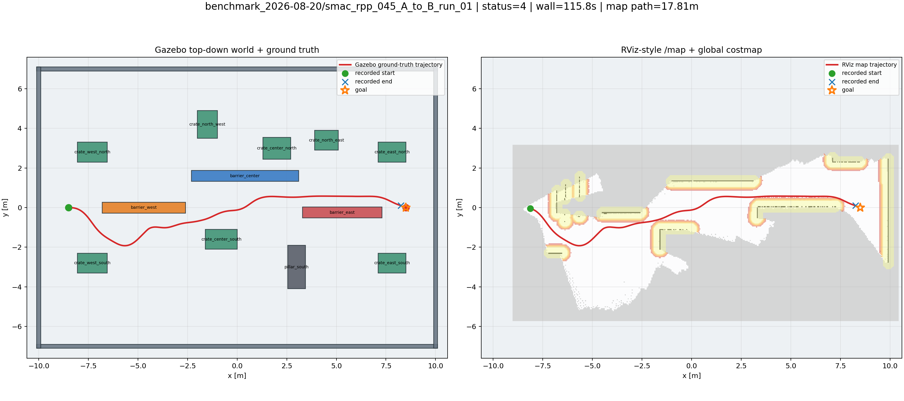

左侧是 Gazebo SDF 障碍物俯视图和 /gazebo/model_states 真值；右侧是 /map、global
costmap 和 map-frame 轨迹的 RViz 风格视图。

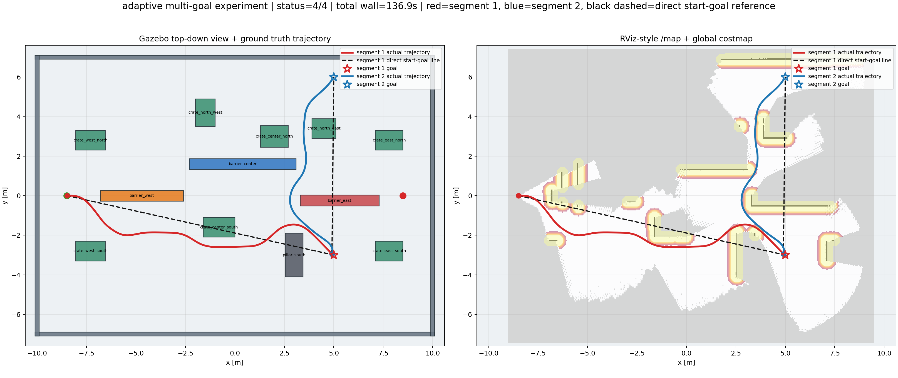

多目标彩色线表示实际分段轨迹，黑色虚线表示该段起点到目标的直接参考线。两边不要求
像素级重合：左边是 Gazebo 真值，右边是经过 TF、在线地图和感知代价地图后的导航证据。

### 8.4 成功判定

~~~text
overall_succeeded = true
每个目标段 nav2_status = 4
gazebo_non_ground_contact = false
gazebo_contact_pairs = "(none)"
图、CSV、metrics、参数和世界快照完整
profile、world、commit 可追溯
~~~

status=6 即使无物理碰撞，也只能记为安全停止/导航失败；status=4 但有非地面 contacts，
也不能记为无碰撞成功。

## 9. 项目演进：从能跑通到可审计的在线导航

本节按照实际工程顺序说明每一阶段为什么出现、做了什么、得到什么、为什么继续
改变。阶段结果不是“越新越一定更通用”：有些版本是速度 benchmark，有些版本是
通用性验证，有些版本是失败排查。论文或交接时必须同时标注用途。

### 9.1 阶段 0：基础链路、场景和证据框架

最初的任务是先让一条最小闭环跑通：

~~~text
启动 Gazebo
  -> 生成 TurtleBot3 和模拟 RGB-D
  -> RTAB-Map 产生 map->odom 和二维占据图
  -> Nav2 读取地图、生成全局路径
  -> RPP 跟踪路径
  -> 机器人到达 A -> B
~~~

这一阶段解决的是“节点能否同时启动、TF 是否连通、深度能否形成障碍点云、Nav2
能否接收目标、机器人能否在仿真中运动”。当时的视图问题也被拆开处理：

- Gazebo 左侧/俯视图用于看真实 SDF 物理世界；
- RViz2 用于看 map、TF、点云、costmap、global path、local path 和机器人姿态；
- `trajectory_comparison.png` 将两类视图并排保存，避免只看 RViz2 就把地图估计误认为
  Gazebo 真值；
- Gazebo contacts 被加入验收，使“看起来没有撞”变成可复核的物理证据。

这一阶段的关键认识是：RViz2 中的地图会随着在线观测增长，初始视角、Fixed Frame、
地图 origin 和未知区域显示方式都会影响视觉效果；Gazebo 的世界文件则是物理真值，
二者不应要求像素级一致。

### 9.2 阶段 1：原生 Smac + RPP 的 0.45/0.55 基线

先用 Nav2 原生 `SmacPlanner2D` 和 `RegulatedPurePursuitController` 建立父版本，
然后在同一个 large 世界中比较全局/局部 inflation 0.45 m 与 0.55 m。

基线任务是：

~~~text
A = (-8.5, 0.0) -> B = (8.5, 0.0)
online=true, localization=false, reset_db=true
~~~

结果：

| 配置 | 成功 | 平均 wall | 平均 Gazebo 路径 | 物理 contacts |
| --- | ---: | ---: | ---: | ---: |
| 0.55 m | 3/3 | 116.425 s | 18.389 m | 0/3 |
| 0.45 m | 3/3 | 114.913 s | 18.173 m | 0/3 |

原生基线给出了两个重要工程结论：

1. 0.45 m 在当前世界里确实更快、路径略短，但近似 clearance 更小，更容易出现
   “RViz 看起来贴边”的现象；
2. 0.55 m 的安全梯度更宽，代价地图更保守；它不是“机器人必须离障碍 0.55 m”，而是
   障碍物周围约 0.55 m 范围内持续产生递减代价，硬可行性仍由 footprint 和 lethal
   cell 决定；
3. 在无非地面 contacts 的前提下，本项目当时按“时间越短越好”保留 0.45 作为后续
   目标线优化的父版本，同时保留 0.55 作为安全对照；
4. `minimum_approx_clearance_m` 是静态几何的保守诊断，不能替代 Gazebo contacts。
   0.45 run02 近似值为负，不代表已经发生物理碰撞。

代表图：

完整三次轨迹和指标见
[BENCHMARK_2026-08-20_SUMMARY.md](../02_原生规划基准_2026-08-20/BENCHMARK_2026-08-20_SUMMARY.md)。

### 9.3 阶段 2：GoalLineSmacPlanner 目标线软偏好

用户观察到原生规划器有时会沿障碍物边缘行驶，或者绕过障碍后没有及时回到目标
方向。于是加入 `GoalLineSmacPlanner`，但保持底层 Smac 搜索、footprint、inflation、
RPP、碰撞监视和世界都不变，便于做单变量对照。

它的设计原则是：

~~~text
可行性由原始 costmap 和 SmacPlanner2D 决定
目标线只用于可行绕行分支之间的软排序
障碍物硬约束不能被目标线代价覆盖
~~~

每次 `createPlan(start, goal)`：

1. 读取本次请求的当前 start 和当前 goal；
2. 遍历当前 costmap 栅格；
3. 跳过 lethal/inscribed 硬障碍；
4. 计算单元格中心到 start-goal 线段的距离；
5. 对可行自由格叠加二次距离软代价；
6. 调用继承的 SmacPlanner2D 搜索；
7. 恢复临时修改的 costmap。

当前目标线代价近似为：

~~~text
d = cell 到当前 start-goal 线段的距离
line_cost = min(line_bias_max_cost * (d / scale)^exponent, 252)
~~~

当直线穿过障碍时，目标线不会让机器人穿过障碍，而是让绕行完成后更倾向于回到
目标方向。它不是一条发送给底盘的离散轨迹，也不包含历史 waypoint。

三次结果：

| 方案 | 成功 | 平均 wall | 平均 Gazebo 路径 | 末端误差均值 | contacts |
| --- | ---: | ---: | ---: | ---: | --- |
| 原生 0.45 | 3/3 | 114.913 s | 18.173 m | 0.271 m | 0/3 |
| 目标线 0.45 | 3/3 | 113.63 s | 17.977 m | 0.162 m | 0/3 |

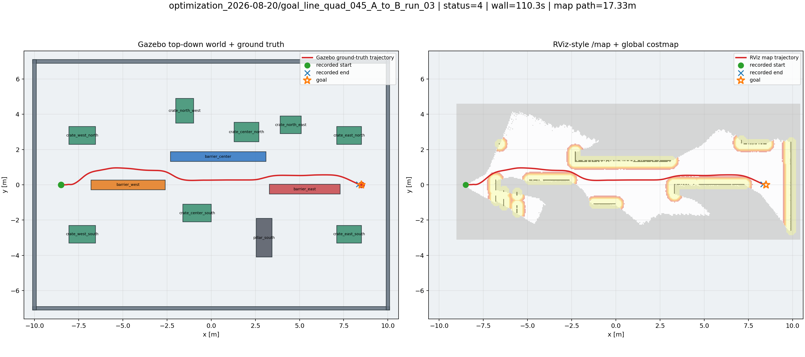

这一步证明的是“加入目标线软偏好不会破坏原生可行性，并能在当前世界略微改善方向
一致性”；它不是证明全局最优。在线未知地图中，障碍物还没被 RGB-D 看见之前，
规划器只能依据当时的地图，所以三次可能选择不同绕障侧。

详细记录见
[NAVIGATION_OPTIMIZATION_2026-08-20.md](../03_目标线规划优化_2026-08-20/NAVIGATION_OPTIMIZATION_2026-08-20.md)。

### 9.4 阶段 3：快速目标线 v1 到 v4

GoalLine 方向改善后，下一目标是把 large 场景 A→B 从约 115 s 降到接近 100 s
以内，同时减少绕障后大幅偏离目标线的现象。

v1 到 v3 主要围绕以下因素做了小步迭代：

- 目标线软代价的强度和距离尺度；
- RPP 的 `desired_linear_vel`；
- RPP lookahead 和动态前视范围；
- costmap inflation 的代价衰减；
- 起步等待，使 RTAB-Map 和障碍层先收到稳定观测。

v4 在此基础上加入了一个当前 large benchmark 专用的固定世界坐标 side schedule，
把已知障碍布局对应的可行走廊作为软偏好，并让 RPP 以 0.30 m/s、更长前视跟踪。

v4 的代表性参数变化：

| 参数 | v3 | v4 |
| --- | ---: | ---: |
| RPP desired velocity | 0.26 m/s | 0.30 m/s |
| lookahead | 0.75 m | 0.80 m |
| 动态前视 | 0.56--1.15 m | 0.62--1.20 m |
| lookahead_time | 1.5 s | 1.7 s |
| cost scaling factor | 3.0 | 4.5 |
| inflation radius | 0.45 m | 0.45 m |
| 走廊目标 | 单一侧向偏好 | 0.95 -> 0.75 -> 0.60 -> 0.58 -> 0 |

v4 三次 A→B：

| run | wall | Gazebo 路径 | 状态 | contacts |
| --- | ---: | ---: | ---: | --- |
| 01 | 79.01 s | 17.336 m | 4 | none |
| 02 | 78.26 s | 17.451 m | 4 | none |
| 03 | 85.94 s | 17.359 m | 4 | none |
| 平均 | 81.07 s | 17.382 m | 3/3 | 0/3 |

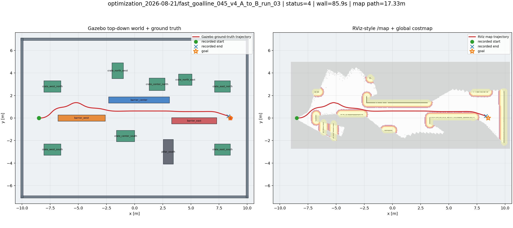

v4 是当前 large 场景中最好看的、最快的一组历史 benchmark，但必须如实标注：
它利用了该 world 的固定坐标先验，因此不能作为“换一个地图仍然自动知道走廊”的
证明。它保留在仓库中，用于复现速度结果、展示工程优化过程和作为后续通用算法的
对照。

详细记录见
[NAVIGATION_OPTIMIZATION_2026-08-21_FAST_GOALLINE_V4.md](../04_快速目标线v4_2026-08-21/NAVIGATION_OPTIMIZATION_2026-08-21_FAST_GOALLINE_V4.md)。

### 9.5 阶段 4：自适应目标线，移除固定场景路线

为了验证“不是背路线”，关闭 v4 的 world-coordinate side schedule，保留只依赖
当前 start、当前 goal 和实时 costmap 的目标线偏好，形成
`adaptive_goal_line_045`。

这一步的核心差异：

| 项目 | v4 | adaptive_goal_line_045 |
| --- | --- | --- |
| 目标线 | 当前段目标线 + world side schedule | 只用当前段目标线 |
| 固定 x/y 走廊 | 有 | 无 |
| 目标更新 | 目标段脚本更新 | 每段新目标重新规划 |
| 新场景适配 | 需要重新设计 schedule | 可直接作为候选基线 |
| 速度 | 0.30 m/s | 约 0.28 m/s |
| 用途 | large 场景快速 benchmark | 跨场景通用基线 |

先做 M→A→B 三次双目标验证：

| run | wall | 轨迹 | 分段 | contacts |
| --- | ---: | ---: | ---: | --- |
| 01 | 144.10 s | 26.312 m | 2/2 | none |
| 02 | 132.77 s | 25.483 m | 2/2 | none |
| 03 | 136.05 s | 25.542 m | 2/2 | none |
| 平均 | 137.64 s | 25.779 m | 6/6 | 0/3 |

之后在 large world 做 M→A→B→C→D→M 五点闭环：

| run | wall | 总轨迹 | 分段 | contacts |
| --- | ---: | ---: | ---: | --- |
| 01 | 283.769 s | 51.128 m | 5/5 | none |
| 02 | 282.744 s | 51.488 m | 5/5 | none |
| 03 | 299.175 s | 53.142 m | 5/5 | none |
| 平均 | 288.563 s | 51.919 m | 15/15 | 0/3 |

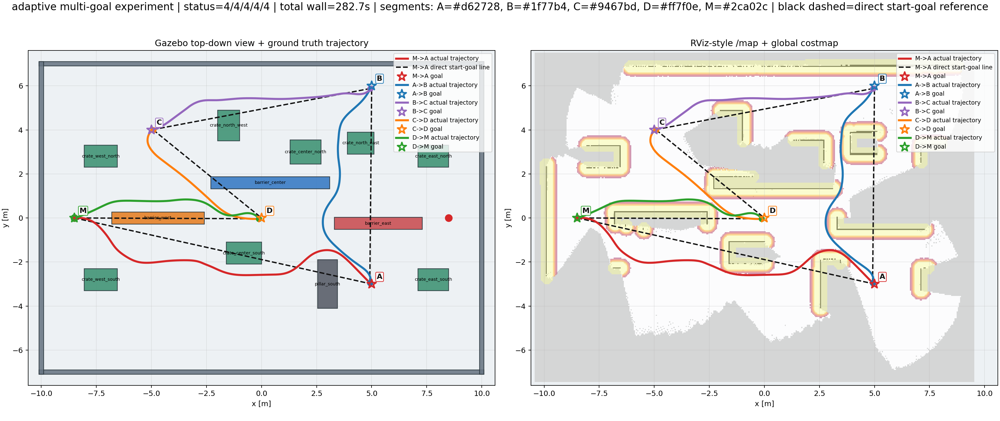

这一阶段首次把“当前目标改变后，黑色 start-goal 参考线随之改变”和“同一轮地图在
多个目标段持续累积”同时验证起来。它仍然只证明 large 静态世界，不代表所有陌生
环境都能成功。
### 9.6 阶段 5：改变点位顺序，检查是否依赖固定访问路线

为了进一步排除“脚本背了某一条顺序路线”，在相同五点和相同 large 世界改变访问顺序：

~~~text
实验 1：C -> A -> D -> B -> M -> C
实验 2：B -> M -> A -> C -> D -> B
~~~

这两组加上原始 M→A→B→C→D→M，共三组闭环。每组 3 次，检查：

- 起点不仅是 M，也可以从 C 或 B 开始；
- 每一段目标都由当前 action 单独发送；
- 目标线随当前段重新定义；
- 轨迹颜色、段落时间和末端误差可分开核对；
- 同一套 profile 不需要把访问顺序写入规划器。

large 场景已有三次闭环 15/15 段成功；场景 01 进一步用改变障碍布局做了完整
三组顺序验证。代表图：

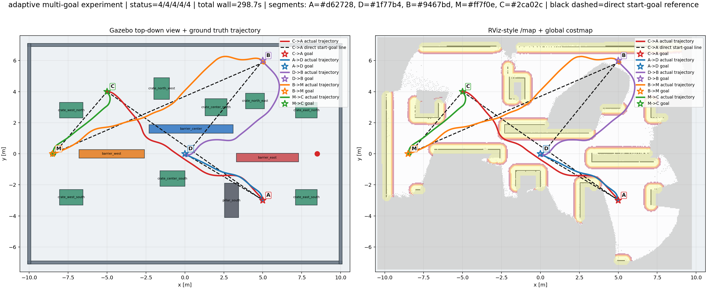

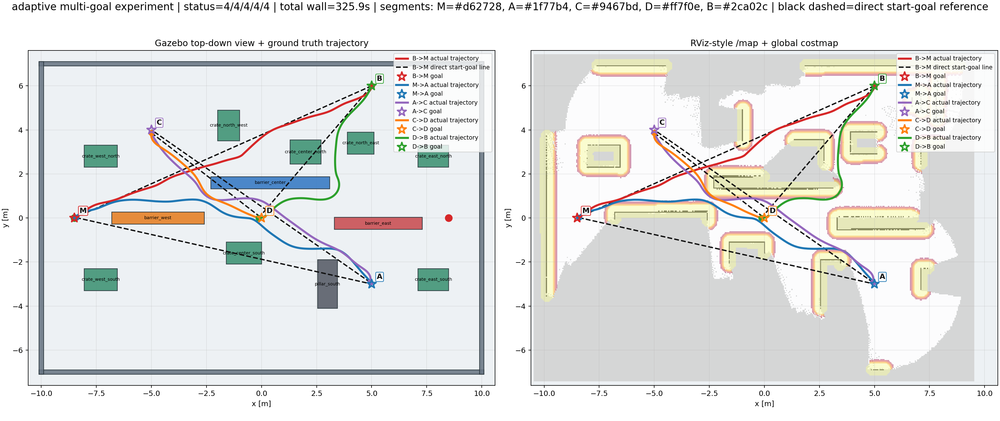

结论不是“访问顺序对路径没有任何影响”。顺序改变会改变当前 start、当前 goal、
已建地图覆盖范围、目标线方向和首次观测顺序，因此轨迹和时间当然会变化；真正被
验证的是：规划器没有读取固定的中间 waypoint 来回放旧路线。

### 9.7 阶段 6：跨场景场景 01

场景 01 保留房间和机器人尺寸，改变障碍物的位置、方向与局部拓扑。仍使用
adaptive_goal_line_045，不为新世界设计 side schedule。

三组访问顺序、每组三次：

~~~text
M -> A -> B -> C -> D -> M
C -> A -> D -> B -> M -> C
B -> M -> A -> C -> D -> B
~~~

结果：

- 9/9 完整 run 成功；
- 45/45 目标段 status=4；
- 0/9 run 产生非地面 Gazebo contacts；
- 三组平均 wall 约为 292.229 s、288.647 s、342.412 s。

三张代表图覆盖三种访问顺序：

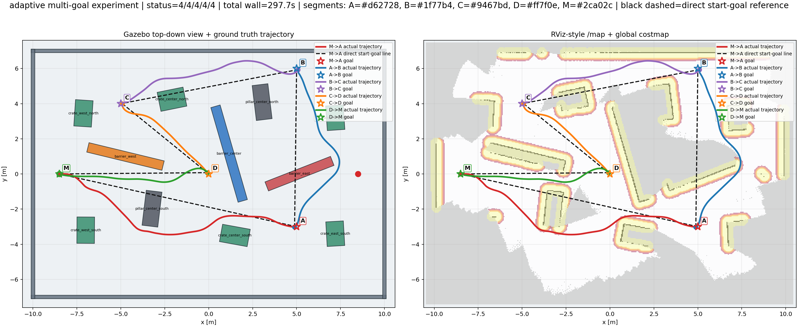

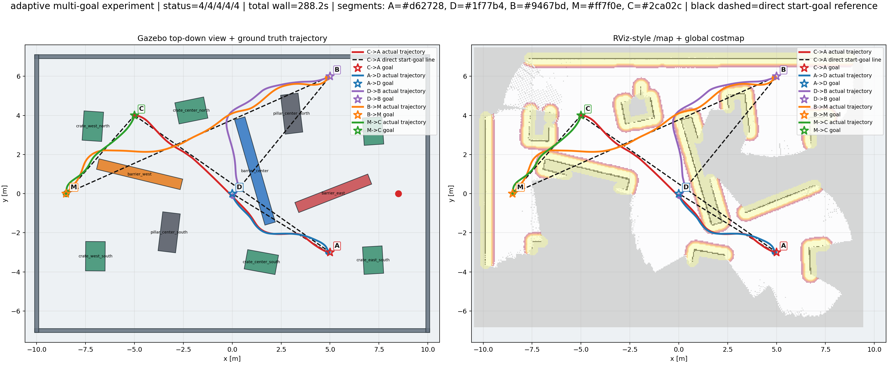

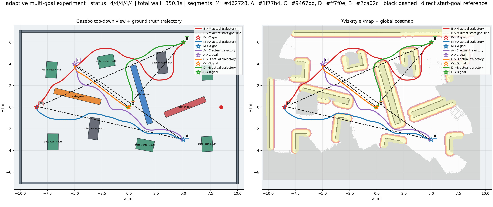

场景 01 是当前“换一组静态障碍布局后，不依赖 v4 固定坐标走廊”的最重要证据。
但是它仍然是人工设计的、静态、可通行的仿真世界；结论应写成“在该类场景和该 profile
下完成验证”，而不是“任意未知环境 100%”。

### 9.8 阶段 7：跨场景场景 02，从失败现象到 v13

场景 02 采用交错障碍和更困难的通道结构，首先验证 M→N 单段，再验证：

~~~text
M(-8.5,0) -> N(8.5,0) -> X(-3,-4) -> Y(5,5) -> M(-8.5,0)
~~~

早期 v5 虽然三次完整成功、0/3 contacts，但 run1/run2 的 N→X 曾出现南侧大回环：
在 (2.5,-4) 附近发现当前方向不可行时，没有立即形成合适的横向绕行，而是先退到
约 (6,-6) 再重新掉头去 X。这不是脚本显式发送 (6,-6)，而是在线地图时序、局部
前向碰撞检查、全局可行分支选择、常规不允许倒车和恢复行为共同产生的可行但不理想路径。

随后保留 v5、v11、v12 作为历史诊断，最终形成 v13：

- inflation 调为 0.50 m，仅作为场景 02 冻结安全梯度；
- line_bias_max_cost=18.0、line_bias_distance_scale=2.8 m、指数 2；
- 关闭 goal_progress_bias、unknown_bias、side_bias；
- 保留约 6 s 周期重规划；
- RPP 使用 0.28 m/s，lookahead 0.52--1.05 m；
- 行为树保留清理 costmap、Spin、Wait、短 BackUp 后重规划；
- 不加入 (6,-6) 或其他固定中间坐标。

v13 三次结果：

| run | wall | 总轨迹 | 最大末端误差 | 4 段 | contacts |
| --- | ---: | ---: | ---: | --- | --- |
| 01 | 539.848 s | 98.210 m | 0.162 m | 4/4 | none |
| 02 | 540.191 s | 98.042 m | 0.162 m | 4/4 | none |
| 03 | 449.438 s | 85.223 m | 0.132 m | 4/4 | none |
| 平均 | 509.826 s | 93.825 m | 0.162 m | 12/12 | 0/3 |

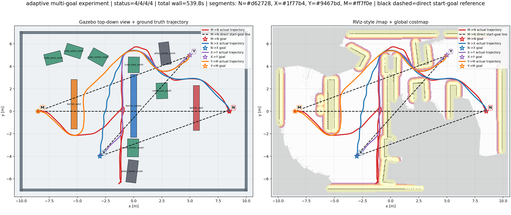

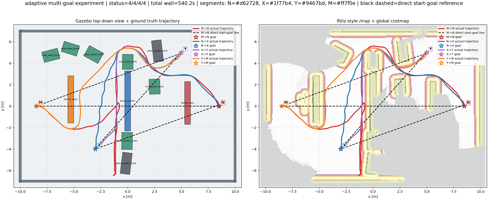

v13 的关键改善是 N→X 三次均约 21 m，时间标准差约 0.4 s，旧版南侧长回环没有在
正式三次中复现。平均约 510 s 达到用户为该场景提出的目标，但 run1/run2 与 run3
仍有明显总体时间和路径方差，因此不能把 510 s 写成固定单次上限或保证值。

### 9.9 版本选择结论

当前三个 profile 的职责应分开：

| profile | 适用范围 | 是否含场景固定先验 | 当前用途 |
| --- | --- | --- | --- |
| adaptive_goal_line_045 | 跨场景候选基线 | 否 | 新场景和通用比较首选 |
| fast_goalline_045_v4 | large 旧 benchmark | 是 | 历史最快结果和方法演进对照 |
| adaptive_goal_line_050_recovery_v13_line_tiebreaker | 场景 02 | 否 | 场景 02 当前正式验收 profile |

不能因为 v4 某一次图最好看，就把它称作跨场景通用最终算法；也不能因为 v13 在
场景 02 成功，就宣称任意未知环境成功率 100%。

## 10. 一次导航任务到底怎样执行

### 10.1 启动时的时序

~~~text
宿主机
  -> docker compose 启动 ros2 容器
  -> launch_demo.sh 启动 Gazebo world
  -> spawn TurtleBot3 Waffle 和 RGB-D camera
  -> 发布 /clock、/odom、camera topics、TF

感知与建图
  -> point_cloud_xyz 生成 /camera/cloud
  -> obstacles_detection 分离 /camera/obstacles、/camera/ground
  -> RTAB-Map 累计 RGB-D 关键帧和占据栅格
  -> map_padder 将 /map 发布为固定大小 /nav_map

导航
  -> global costmap 订阅 /nav_map 和实时 obstacles
  -> local costmap 在 odom rolling window 更新
  -> planner_server 收到当前 start/goal
  -> GoalLineSmacPlanner 临时加软偏好并调用 Smac
  -> controller_server 的 RPP 跟踪 global path
  -> velocity_smoother 平滑速度
  -> collision_monitor 检查 RGB-D 点云，输出安全速度
  -> Gazebo 差速底盘执行 /cmd_vel_safe
~~~

启动完成后，回归脚本并不把整个轨迹发给机器人。它只按顺序发送：

~~~text
NavigateToPose(current_pose, goal_1)
等待 status=4
记录第一段时间、长度、末端误差和 contacts
NavigateToPose(current_pose, goal_2)
等待 status=4
...
~~~

对多目标任务，脚本根据上一段结束时的机器人状态继续下一段。每次目标变化会改变
当前 start-goal 线，规划器重新在当时 costmap 上搜索。彩色线只记录实际运动，不是
下一段的输入路径。

### 10.2 规划与控制的分工

全局规划器回答：“从当前地图看，哪些栅格序列可以到达目标？”

RPP 回答：“沿这条路径，当前速度和前视距离应该是多少？”

collision_monitor 回答：“即使上层给了速度，当前 RGB-D 点云是否允许执行；若危险，
当前是否应减速或硬停止？”

因此机器人“停下来”可能来自三类不同原因：

1. planner 无法在当前 costmap 找到路径；
2. RPP 因曲率、代价或前向碰撞投影把速度压低；
3. collision_monitor 看到 stop polygon 或点云超时，主动拦截速度。

只看 RViz 的红色膨胀层不能直接判定是哪一类。排错必须同时看 action 状态、global
plan、local plan、/cmd_vel、/cmd_vel_safe、点云和 costmap。

### 10.3 为什么会贴边或绕大弯

代价地图并非只有“能走/不能走”两种状态：

- lethal/inscribed cell 是硬不可行；
- inflation 区域是从障碍物向外衰减的软代价；
- Smac 会累计栅格代价和 travel multiplier；
- GoalLine 只改变可行候选之间的代价排序；
- RPP 会因为局部曲率和碰撞预测减速；
- RGB-D 识别误差可能让障碍物短暂变大或使空间变 unknown。

如果绕行的一侧在当时地图上看起来更短、可见或代价累计更低，Smac 可能选择它，
即使人类从 Gazebo 真值图看另一侧“更直”。如果目标线穿过障碍，系统不能沿黑线硬
冲，只能先偏离；目标线插件的作用是让偏离尽量小、障碍结束后尽量回归，而不是提前
知道全部未来障碍。
## 11. 当前参数的完整解释

### 11.1 几何和地图参数

| 参数 | 当前值 | 解释 |
| --- | ---: | --- |
| footprint | 0.60 × 0.48 m 左右 | 机器人本体的碰撞近似轮廓 |
| footprint padding | 0.03 m | 在 footprint 外再保守增加 |
| map resolution | 0.05 m/cell | 规划栅格分辨率 |
| global map | 24 × 17 m | 固定 /nav_map 的容器范围 |
| local window | 6 × 5 m | 随 odom 滚动的局部地图 |
| RGB-D max depth | 3.5 m | 障碍感知最大深度 |
| point cloud decimation | 4 | 降低点云量和延迟 |
| point cloud voxel | 0.04 m | 障碍点云体素化 |
| RTAB-Map Grid/RangeMax | 4 m | 建图射线最大范围 |
| RTAB-Map MaxObstacleHeight | 1.5 m | 进入二维障碍地图的高度上限 |

### 11.2 通用基线

~~~text
profile = adaptive_goal_line_045
global/local inflation_radius = 0.45 m
global/local cost_scaling_factor = 4.5
cost_travel_multiplier = 6.0
line_bias_enabled = true
line_bias_apply_to_unknown = false
goal_progress_bias_enabled = false
unknown_bias_enabled = false
side_bias_enabled = false
desired_linear_vel ≈ 0.28 m/s
allow_reversing = false
use_rotate_to_heading = true
~~~

### 11.3 场景 02 v13

~~~text
profile = adaptive_goal_line_050_recovery_v13_line_tiebreaker
global/local inflation_radius = 0.50 m
global/local cost_scaling_factor = 4.5
line_bias_max_cost = 18.0
line_bias_distance_scale = 2.8 m
line_bias_exponent = 2.0
cost_travel_multiplier = 6.0
goal_progress_bias_enabled = false
unknown_bias_enabled = false
side_bias_enabled = false
RPP desired_linear_vel = 0.28 m/s
RPP lookahead_dist = 0.68 m
RPP min/max lookahead = 0.52 / 1.05 m
RPP lookahead_time = 1.5 s
RPP max collision time = 1.5 s
periodic replanning = about 6 s
recovery = clear -> spin -> wait -> backup -> replan
~~~

### 11.4 参数之间的实际关系

建议把参数分成四层理解：

| 层 | 主要参数 | 主要问题 |
| --- | --- | --- |
| 几何安全 | footprint、padding、lethal、inflation radius | 能不能通过、离障碍多近 |
| 全局选择 | cost_travel_multiplier、line_bias | 在多个可行绕行分支中选哪条 |
| 局部跟踪 | desired velocity、lookahead、curvature scaling | 是否平滑、是否提前转向、速度快慢 |
| 失效保护 | collision polygons、source timeout、recovery tree | 发现危险或卡住时如何降速、停止、恢复 |

修改时一次只动一层、一个变量，并重新跑三次；不能同时改 inflation、速度、RPP、
行为树和 GoalLine，否则无法解释结果变化。

## 12. 如何阅读每一张 trajectory_comparison.png

每张双视图图像约定如下：

- 左图：按 SDF 解析得到的 Gazebo 障碍物俯视图，叠加 Gazebo 真值轨迹；
- 右图：保存时的 map/costmap 视角，叠加 map-frame 轨迹、目标、机器人起终点；
- 彩色轨迹：多目标任务的不同目标段；
- 黑色虚线：当前段起点到当前段目标的欧氏直线；
- 点标记：任务起点、各目标点和最终返回点；
- 实线不是预录制路径，而是实际采样轨迹；
- 左右图的坐标可能因 TF、地图原点、绘图范围不同而出现平移或旋转，不做像素级
  叠加比较。

看图时按以下顺序：

1. 先看左图是否发生物理穿模、是否贴近真实障碍；
2. 再看右图是否能在 /map 和 costmap 中解释路径选择；
3. 对照每一段 CSV 查看目标切换时刻；
4. 最后查看 metrics.yaml 的 status、误差和 contacts；
5. 如果“图看起来撞了”但 contacts 是 none，检查图像采样、模型 footprint、
   SDF collision 几何和绘图坐标，不要只凭视觉改结论。

### 12.1 正式代表图索引

以下图片均来自仓库已有结果，重新运行不会覆盖，因为每次使用独立目录：

| 阶段 | 代表图 |
| --- | --- |
| 原生 0.45 | [baseline run01](../../results/01_原生规划基准/benchmark_2026-08-20/smac_rpp_045_A_to_B_run_01/trajectory_comparison.png) |
| GoalLine | [goal-line run03](../../results/02_目标线规划优化/optimization_2026-08-20/goal_line_quad_045_A_to_B_run_03/trajectory_comparison.png) |
| v4 | [v4 run03](../../results/03_V4快速目标线/optimization_2026-08-21/fast_goalline_045_v4_A_to_B_run_03/trajectory_comparison.png) |
| 自适应双目标 | [MAB representative](../../results/04_自适应目标线多目标/自适应目标线_多目标_修正版_2026-08-21/trajectory_comparison.png) |
| 五点闭环 | [large run02](../../results/04_自适应目标线多目标/自适应目标线_五点闭环_2026-08-22/run_02/trajectory_comparison.png) |
| 场景 01 MABCDM | [scene01 run02](../../results/05_跨场景验证/场景01/跨场景场景01_五点闭环_MABCDM_2026-08-22/run_02/trajectory_comparison.png) |
| 场景 01 CADBMC | [scene01 CADBMC run02](../../results/05_跨场景验证/场景01/跨场景场景01_顺序实验1_CADBMC_2026-08-22/run_02/trajectory_comparison.png) |
| 场景 01 BMACDB | [scene01 BMACDB run02](../../results/05_跨场景验证/场景01/跨场景场景01_顺序实验2_BMACDB_2026-08-22/run_02/trajectory_comparison.png) |
| 场景 02 历史异常 | [v12 pilot](../../results/05_跨场景验证/场景02/02_历史参考/场景02_v12_目标进度优先_MNX_pilot_2026-08-23/trajectory_comparison.png) |
| 场景 02 v13 run01 | [v13 run01](../../results/05_跨场景验证/场景02/01_正式验收/场景02_四点闭环_目标线轻偏好v13_2026-08-23/run_01/trajectory_comparison.png) |
| 场景 02 v13 run02 | [v13 run02](../../results/05_跨场景验证/场景02/01_正式验收/场景02_四点闭环_目标线轻偏好v13_2026-08-23/run_02/trajectory_comparison.png) |
| 场景 02 v13 run03 | [v13 run03](../../results/05_跨场景验证/场景02/01_正式验收/场景02_四点闭环_目标线轻偏好v13_2026-08-23/run_03/trajectory_comparison.png) |

## 13. 完整复现操作

### 13.1 清洁启动和构建

~~~bash
cd /home/w417/RTAB-Map
sg docker -c './scripts/stop.sh'
sg docker -c './scripts/start.sh'
sg docker -c 'docker compose exec -T ros2 bash -lc "source /opt/ros/humble/setup.bash && cd /workspaces/rtabmap_tb3_nav && colcon build --symlink-install"'
~~~

只改文档时不需要 build。修改 C++、launch、YAML、行为树或 world 后，应先执行上述
build，再重新启动 launch。由于源码是 symlink install，开发时部分 Python/launch
改动会直接映射，但为了交接和正式实验仍建议完整 build。

### 13.2 启动 Gazebo 与 RViz2

~~~bash
cd /home/w417/RTAB-Map
sg docker -c './scripts/launch_demo.sh \
  gazebo_gui:=true rviz:=true rtabmap_viz:=false \
  online:=true localization:=false reset_db:=true \
  navigation_profile:=adaptive_goal_line_045'
~~~

启动后检查：

~~~bash
sg docker -c 'docker compose exec -T ros2 bash -lc "source /opt/ros/humble/setup.bash && ros2 node list"'
sg docker -c 'docker compose exec -T ros2 bash -lc "source /opt/ros/humble/setup.bash && ros2 topic list | rg \"(map|odom|cloud|obstacle|cmd_vel|plan|costmap)\""'
~~~

若系统没有显示窗口，优先检查宿主机 X11、gazebo_gui:=true、rviz:=true 和
Docker 的 DISPLAY/XAUTHORITY 挂载；后台回归实验可以将二者设为 false。

### 13.3 单段 A→B

~~~bash
cd /home/w417/RTAB-Map
sg docker -c 'docker compose exec -T ros2 bash -lc "source /opt/ros/humble/setup.bash && source /workspaces/rtabmap_tb3_nav/install/setup.bash && ros2 run rtabmap_tb3_nav send_goal.py --x 8.5 --y 0.0 --yaw 0.0 --settle-seconds 5"'
~~~

只发送一个目标，不会生成正式结果目录；要保留图和指标，使用回归脚本。

### 13.4 large 世界五点闭环

~~~bash
cd /home/w417/RTAB-Map
sg docker -c './scripts/multi_waypoint_regression.sh \
  --start-name M --start-x -8.5 --start-y 0.0 \
  --goal A:5.0:-3.0:0.0 \
  --goal B:5.0:6.0:0.0 \
  --goal C:-5.0:4.0:0.0 \
  --goal D:0.0:0.0:0.0 \
  --goal M:-8.5:0.0:0.0 \
  --profile adaptive_goal_line_045 \
  --world-file src/rtabmap_tb3_nav/worlds/indoor_obstacle_course_large.world \
  --label 04_自适应目标线多目标/复现/large_五点闭环_$(date +%Y%m%d_%H%M%S) \
  --contact-timeout 1200 --settle-seconds 5'
~~~

启动时要在另一个终端指定同一个 world、起点和 profile；脚本和 launch 的 world/start
必须一致。

### 13.5 场景 01 三组顺序

精确参数和命令见 [阶段2_场景01复现参数](../08_下一阶段实验归档_2026-08-22/02_场景01/阶段2_跨场景场景01复现参数_2026-08-22.md)。

简化的 MABCDM 命令：

~~~bash
sg docker -c './scripts/multi_waypoint_regression.sh \
  --start-name M --start-x -8.5 --start-y 0.0 \
  --goal A:5.0:-3.0:0.0 --goal B:5.0:6.0:0.0 \
  --goal C:-5.0:4.0:0.0 --goal D:0.0:0.0:0.0 \
  --goal M:-8.5:0.0:0.0 \
  --profile adaptive_goal_line_045 \
  --world-file src/rtabmap_tb3_nav/worlds/indoor_obstacle_course_cross_scene_01.world \
  --label 05_跨场景验证/场景01/复现_MABCDM_$(date +%Y%m%d_%H%M%S) \
  --contact-timeout 1200 --settle-seconds 5'
~~~

C 起点和 B 起点的目标顺序见场景 01 复现参数文档；不要把不同顺序的结果放入同一
run 目录。

### 13.6 场景 02 v13 四点闭环

~~~bash
cd /home/w417/RTAB-Map
sg docker -c './scripts/launch_demo.sh \
  gazebo_gui:=true rviz:=true rtabmap_viz:=false \
  online:=true localization:=false reset_db:=true \
  world_file:=/workspaces/rtabmap_tb3_nav/src/rtabmap_tb3_nav/worlds/indoor_obstacle_course_cross_scene_02.world \
  navigation_profile:=adaptive_goal_line_050_recovery_v13_line_tiebreaker \
  x_pose:=-8.5 y_pose:=0.0'
~~~

另一个终端：

~~~bash
sg docker -c './scripts/multi_waypoint_regression.sh \
  --start-name M --start-x -8.5 --start-y 0.0 \
  --goal N:8.5:0.0:0.0 --goal X:-3.0:-4.0:0.0 \
  --goal Y:5.0:5.0:0.0 --goal M:-8.5:0.0:0.0 \
  --profile adaptive_goal_line_050_recovery_v13_line_tiebreaker \
  --world-file src/rtabmap_tb3_nav/worlds/indoor_obstacle_course_cross_scene_02.world \
  --label 05_跨场景验证/场景02/03_新实验/示范复现_v13_$(date +%Y%m%d_%H%M%S) \
  --contact-timeout 1200 --settle-seconds 5'
~~~

### 13.7 保存轨迹图和结果的规则

- 每次实验必须使用新的 --label；
- 同一大组内部使用 run_01、run_02、run_03；
- 不覆盖已经冻结的正式目录；
- label 中记录场景、profile、任务、日期和 run；
- 结果目录至少包含双视图 PNG、原始/真值 CSV、metrics、参数快照、world 快照和
  contacts 摘要；
- 新实验只在三次都满足成功和无非地面 contacts 后，才可进入正式统计；
- 历史失败案例保留在历史参考目录，不能删除证据后改写平均值。
## 14. 修改、复现和回退规则

### 14.1 修改源码或参数前

先记录：

~~~bash
git status --short
git log -1 --oneline
cp src/rtabmap_tb3_nav/config/nav2_rgbd_params.yaml /tmp/nav2_rgbd_params.before_experiment.yaml
~~~

正式实验不建议把 YAML 直接改成无法区分的“当前值”。更可靠的方式是：

1. 复制世界文件或建立新 profile；
2. 一次只改变一个变量；
3. 使用新日期/新 label；
4. 保存运行时参数快照；
5. 三次独立重启；
6. 把均值、标准差、失败原因和代表图写入新的中文文档；
7. Git 提交代码、profile 文档和实验报告。

`results/` 中的快照是实验当时的证据，不应被当前工作区后来的参数覆盖。

### 14.2 恢复已验证版本

推荐使用 Git 分支或 tag 记录版本。恢复前先查看当前工作区：

~~~bash
git status --short
git log --oneline --decorate -20
~~~

若只是复现已有代码，不要删除当前改动；先建立临时分支或保存未提交文件，再切换
到对应 commit。常用父版本：

| 版本 | 用途 |
| --- | --- |
| be04483 | 原生 0.45 Smac + RPP |
| c18894e | GoalLine 目标线优化 |
| 78bb860 | large 场景 v4 最终代码 |
| 当前 main / 交接 commit | 场景 02 v13 和归档 |

本报告不建议使用破坏性 git reset --hard 直接覆盖用户工作区。若需要精确复现，
应先建立 git worktree 或备份，再切换到目标 commit。

### 14.3 修改 world

~~~bash
cp src/rtabmap_tb3_nav/worlds/indoor_obstacle_course_cross_scene_02.world \
   src/rtabmap_tb3_nav/worlds/indoor_obstacle_course_cross_scene_03.world
~~~

随后只改新文件，并在启动参数中使用新 world。不要覆盖场景 02 正式世界。每次结果
目录保存当次 世界文件.sdf，所以即使之后 world 改变，历史证据仍能复核。

### 14.4 修改起点和终点

起点由 launch 的 x_pose、y_pose 和回归脚本的 --start-* 定义；目标由每一个
--goal NAME:X:Y:YAW 定义。只改变目标不需要修改规划器代码，目标线会随请求自动变化。
如果改变了 world 中机器人初始位置，必须同步 launch 和脚本，且新任务使用新 label。

## 15. 真实 D435i 迁移计划

### 15.1 为什么仿真结果有价值

当前仿真已经验证了软件链路的结构：

- RGB-D topic 到点云；
- /map、odom、base_footprint TF；
- Nav2 global/local costmap；
- 目标线插件；
- RPP；
- collision_monitor；
- 多目标 action 和结果记录。

因此仿真结果可以作为算法基准和接口联调基准，但不能当作真实硬件的性能结论。

### 15.2 真机迁移前的顺序

建议按如下顺序：

~~~text
1. 固定 D435i 机械安装和 camera_link 外参
2. 检查 RGB、depth、camera_info 和深度对齐
3. 检查 USB 带宽、帧率、时间戳和曝光
4. 验证 TF：base_footprint -> base_link -> camera_link -> optical frames
5. 只运行 RTAB-Map，检查 map 是否稳定
6. 只运行 point cloud/obstacle layer，检查障碍位置和高度过滤
7. 低速单段直线，collision_monitor 接管安全速度
8. 低速绕单个箱体，观察停止区和恢复
9. 再做 A→B 三次，最后才做多目标闭环
~~~

真实 launch 不能与 Gazebo launch 同时运行，避免同名 node、topic、TF 和 /cmd_vel
冲突。真实底盘还必须有物理急停、硬件限速和人工接管。

### 15.3 必须重新标定的内容

- 相机到车体的平移/旋转外参；
- depth scale、对齐方式和最小/最大深度；
- 障碍点云的 voxel/decimation；
- footprint 和真实车体碰撞边界；
- local/global inflation 与真实通道宽度；
- collision_monitor 的 stop/slow polygon；
- 真实底盘的线速度、角速度、加速度限制；
- 目标容差和定位漂移。

不能直接把仿真中的 status=4、0 contacts 或约 510 s 复制为真机指标。

## 16. 当前能力、创新点和限制

### 16.1 可作为示范的技术贡献

在当前项目范围内，可以清楚地展示：

1. **RGB-D-only 在线导航链路**：不订阅 /scan，从深度图构造障碍点云并实时建图；
2. **动态目标线软偏好**：对每一次当前 start-goal 计算，帮助绕障后朝目标方向回归；
3. **多层安全闭环**：costmap 硬约束、RPP 前视、速度平滑、collision_monitor 和恢复树；
4. **面向交接的证据体系**：左右双视图、分段轨迹、状态、末端误差和 contacts 同步保存；
5. **跨场景验证思路**：改变障碍布局和访问顺序，区分通用 profile 与场景专用 benchmark。

这些可以作为工程方法和实验设计亮点，但论文中仍需与相关工作比较，并通过消融、
更多随机种子和更多场景支持。

### 16.2 目前不能声称的内容

- 不应称为任意未知环境的自主探索导航；
- 不应称为全局最短路径或时间最优；
- 不应称为完整倒车规划器；
- 不应称为动态障碍物预测；
- 不应称为真实 D435i 已验证；
- 不应把三次 100% 写成统计意义上的绝对成功率；
- 不应把 v4 world corridor 当作无地图通用能力。

### 16.3 下一步建议

1. 创建场景 03，只改变一个环境因素；
2. 先用 adaptive_goal_line_045 做 smoke test，验证通用性；
3. 再按相同记录规则跑三次；
4. 若场景 03 失败，先分析感知、TF、costmap 和 recovery，再决定是否修改参数；
5. 做消融：原生 Smac、GoalLine、v13 recovery profile；
6. 统计更多独立运行，报告均值、标准差、失败类型和轨迹一致性；
7. 真机先做 D435i 静态感知和低速单段，不直接做闭环。

## 17. 交接版最短阅读路线

新 worker 只需按以下顺序阅读即可理解项目：

1. [项目交接 README](README.md)
2. [交接总览](交接总览_2026-08-24.md)
3. [算法链路与参数快照](算法链路与参数快照_2026-08-24.md)
4. [复现启动与实验操作手册](复现启动与实验操作手册_2026-08-24.md)
5. [阶段 2 长篇总览](../08_下一阶段实验归档_2026-08-22/00_阶段总览/阶段2跨场景验证总览与当前状态_2026-08-24.md)
6. [场景 01 详细报告](../08_下一阶段实验归档_2026-08-22/02_场景01/阶段2_跨场景场景01九次实验总结_2026-08-22.md)
7. [场景 02 v13 详细报告](../08_下一阶段实验归档_2026-08-22/03_场景02_正式验收/阶段2_场景02_周期重规划三次实验总结_2026-08-23.md)
8. [完整技术报告（本文）](完整技术路线与阶段结果示范报告_2026-08-24.md)

---
## 18. 附录：正式图片和证据文件清单

### 18.1 单段 A→B 三次图片

- [native 0.45 run01](../../results/01_原生规划基准/benchmark_2026-08-20/smac_rpp_045_A_to_B_run_01/trajectory_comparison.png)
- [native 0.45 run02](../../results/01_原生规划基准/benchmark_2026-08-20/smac_rpp_045_A_to_B_run_02/trajectory_comparison.png)
- [native 0.45 run03](../../results/01_原生规划基准/benchmark_2026-08-20/smac_rpp_045_A_to_B_run_03/trajectory_comparison.png)

### 18.2 GoalLine 三次图片

- [GoalLine run01](../../results/02_目标线规划优化/optimization_2026-08-20/goal_line_quad_045_A_to_B_run_01/trajectory_comparison.png)
- [GoalLine run02](../../results/02_目标线规划优化/optimization_2026-08-20/goal_line_quad_045_A_to_B_run_02/trajectory_comparison.png)
- [GoalLine run03](../../results/02_目标线规划优化/optimization_2026-08-20/goal_line_quad_045_A_to_B_run_03/trajectory_comparison.png)

### 18.3 v4 三次图片

- [v4 run01](../../results/03_V4快速目标线/optimization_2026-08-21/fast_goalline_045_v4_A_to_B_run_01/trajectory_comparison.png)
- [v4 run02](../../results/03_V4快速目标线/optimization_2026-08-21/fast_goalline_045_v4_A_to_B_run_02/trajectory_comparison.png)
- [v4 run03](../../results/03_V4快速目标线/optimization_2026-08-21/fast_goalline_045_v4_A_to_B_run_03/trajectory_comparison.png)

### 18.4 自适应目标线和 large 五点闭环

- [自适应双目标](../../results/04_自适应目标线多目标/自适应目标线_多目标_修正版_2026-08-21/trajectory_comparison.png)
- [large 五点 run01](../../results/04_自适应目标线多目标/自适应目标线_五点闭环_2026-08-22/run_01/trajectory_comparison.png)
- [large 五点 run02](../../results/04_自适应目标线多目标/自适应目标线_五点闭环_2026-08-22/run_02/trajectory_comparison.png)
- [large 五点 run03](../../results/04_自适应目标线多目标/自适应目标线_五点闭环_2026-08-22/run_03/trajectory_comparison.png)

### 18.5 场景 01 九次正式图片

- [MABCDM run01](../../results/05_跨场景验证/场景01/跨场景场景01_五点闭环_MABCDM_2026-08-22/run_01/trajectory_comparison.png)
- [MABCDM run02](../../results/05_跨场景验证/场景01/跨场景场景01_五点闭环_MABCDM_2026-08-22/run_02/trajectory_comparison.png)
- [MABCDM run03](../../results/05_跨场景验证/场景01/跨场景场景01_五点闭环_MABCDM_2026-08-22/run_03/trajectory_comparison.png)
- [CADBMC run01](../../results/05_跨场景验证/场景01/跨场景场景01_顺序实验1_CADBMC_2026-08-22/run_01/trajectory_comparison.png)
- [CADBMC run02](../../results/05_跨场景验证/场景01/跨场景场景01_顺序实验1_CADBMC_2026-08-22/run_02/trajectory_comparison.png)
- [CADBMC run03](../../results/05_跨场景验证/场景01/跨场景场景01_顺序实验1_CADBMC_2026-08-22/run_03/trajectory_comparison.png)
- [BMACDB run01](../../results/05_跨场景验证/场景01/跨场景场景01_顺序实验2_BMACDB_2026-08-22/run_01/trajectory_comparison.png)
- [BMACDB run02](../../results/05_跨场景验证/场景01/跨场景场景01_顺序实验2_BMACDB_2026-08-22/run_02/trajectory_comparison.png)
- [BMACDB run03](../../results/05_跨场景验证/场景01/跨场景场景01_顺序实验2_BMACDB_2026-08-22/run_03/trajectory_comparison.png)

### 18.6 场景 02 正式和历史参考图片

- [MN baseline run01](../../results/05_跨场景验证/场景02/01_正式验收/场景02_MN原参数基线_2026-08-23/run_01/trajectory_comparison.png)
- [MN baseline run02](../../results/05_跨场景验证/场景02/01_正式验收/场景02_MN原参数基线_2026-08-23/run_02/trajectory_comparison.png)
- [MN baseline run03](../../results/05_跨场景验证/场景02/01_正式验收/场景02_MN原参数基线_2026-08-23/run_03/trajectory_comparison.png)
- [v5 run01](../../results/05_跨场景验证/场景02/01_正式验收/场景02_四点闭环_恢复增强v5_2026-08-23/run_01/trajectory_comparison.png)
- [v5 run02](../../results/05_跨场景验证/场景02/01_正式验收/场景02_四点闭环_恢复增强v5_2026-08-23/run_02/trajectory_comparison.png)
- [v5 run03](../../results/05_跨场景验证/场景02/01_正式验收/场景02_四点闭环_恢复增强v5_2026-08-23/run_03/trajectory_comparison.png)
- [v13 run01](../../results/05_跨场景验证/场景02/01_正式验收/场景02_四点闭环_目标线轻偏好v13_2026-08-23/run_01/trajectory_comparison.png)
- [v13 run02](../../results/05_跨场景验证/场景02/01_正式验收/场景02_四点闭环_目标线轻偏好v13_2026-08-23/run_02/trajectory_comparison.png)
- [v13 run03](../../results/05_跨场景验证/场景02/01_正式验收/场景02_四点闭环_目标线轻偏好v13_2026-08-23/run_03/trajectory_comparison.png)
- [历史 v12 异常回环](../../results/05_跨场景验证/场景02/02_历史参考/场景02_v12_目标进度优先_MNX_pilot_2026-08-23/trajectory_comparison.png)

### 18.7 附录判定

附录中的“正式”目录才进入当前统计；v12、v11 和旧 v5/恢复试验作为算法演进或问题
诊断证据。它们不能和 v13 三次平均直接混合，也不能删掉失败后只保留成功图。
